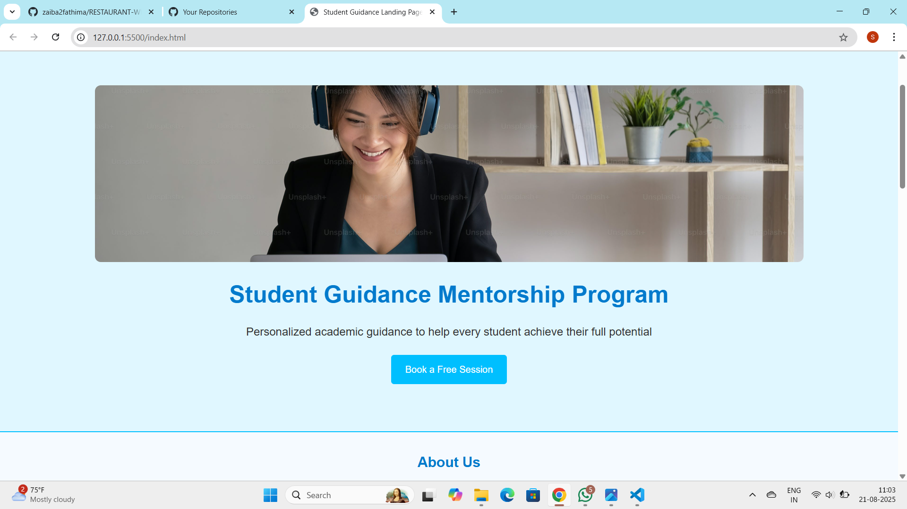

# Student Guidance Mentorship Landing Page

## Overview
This is a *responsive landing page* for a Student Guidance Mentorship Program.  
The page is built using *HTML and CSS* and designed to be accessible, mobile-friendly, and visually appealing.  

## Features
- *Responsive Design*: Works on desktops, tablets, and mobile devices.
- *Hero Section*: Engaging banner with program title, description, and call-to-action button.
- *About Section*: Introduces the mentorship program and mission.
- *Benefits Section*: Highlights key features students receive.
- *How It Works*: Step-by-step guidance process.
- *Testimonials*: Parent and student feedback.
- *FAQs Section*: Common questions with expandable details.
- *Contact Section*: Email and phone information for reaching out.
- *Call-to-Action (CTA)*: Encourages booking a free session.
- *Navigation Bar & Footer*: Smooth navigation and informative footer.
- *Responsive Media Queries*: Optimized for tablets and smartphones.

## Technologies Used
- HTML5
- CSS3
- Flexbox and responsive design principles

## How to Use
1. Clone the repository or download the ZIP.
2. Open index.html in a web browser.
3. The page will display fully responsive and ready to use.

## Screenshot

## Author
*Sadiya Sultana*  
Student Guidance Program Landing Page